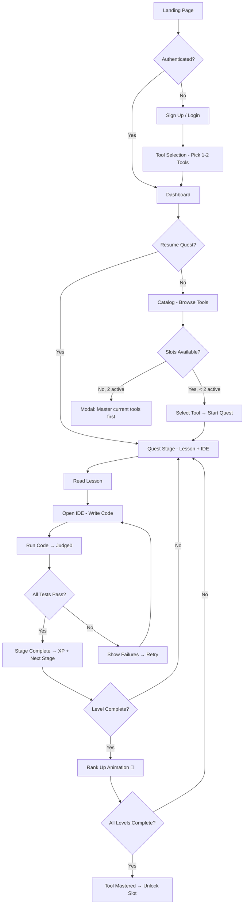
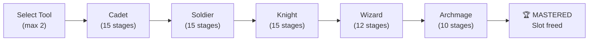
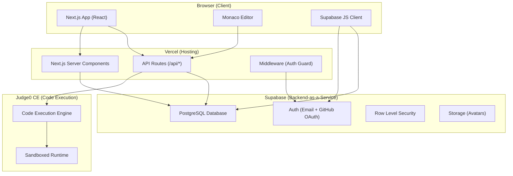
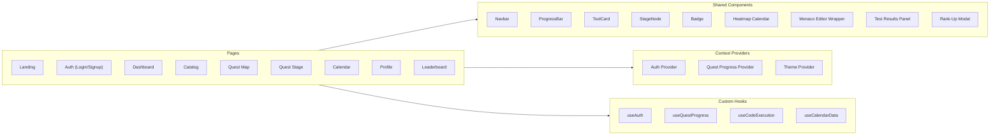
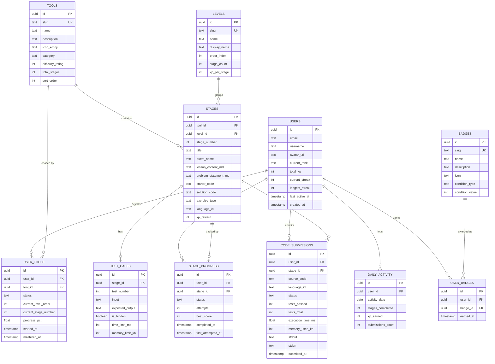
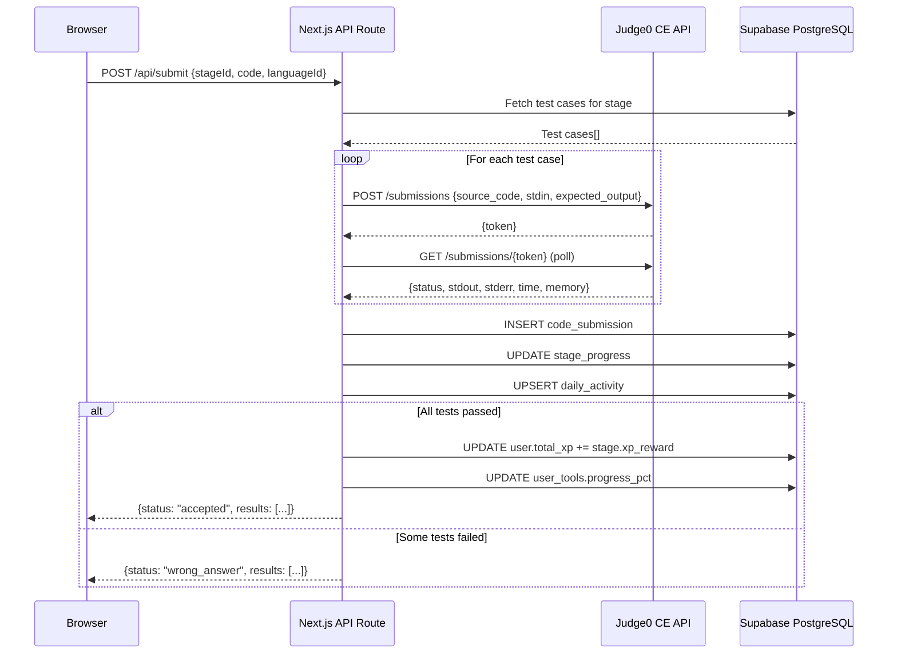
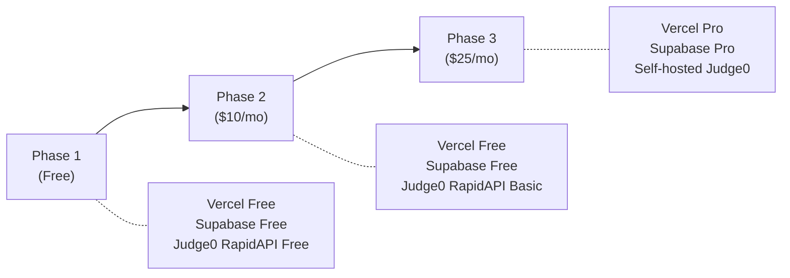

# CodeQuest — Quest-Based Developer Learning Platform

> *"Level up your code. Conquer the stack."*

A full-stack, gamified developer education platform where learners embark on RPG-style quests to master programming languages, developer tools, and frameworks — complete with an in-browser IDE, progress tracking, and a quest calendar.

### 📊 Build Status (Updated: 2026-08-17)

| Phase | Status | Details |
|-------|--------|---------|
| Phase 1: Project Init | ✅ Complete | Next.js 16.3.1, all dependencies installed |
| Phase 2: Database | ✅ Complete | 4 SQL migrations, seed data, curriculum scripts |
| Phase 3: Authentication | ✅ Complete | Supabase SSR auth, middleware, login/signup pages |
| Phase 4: API Routes | ✅ Complete | 10 API routes (tools, quest, submit, run, calendar, profile, leaderboard) |
| Phase 5: Components | ✅ Complete | 10 components (Navbar, CodeEditor, ProgressBar, etc.) |
| Phase 6: Pages | ✅ Complete | 10 pages (Landing, Dashboard, Catalog, Quest, Profile, etc.) |
| Phase 7: Monaco Editor | ✅ Complete | Terminal Noir theme, language configs |
| Phase 8: Stats & Heatmaps | ✅ Complete | Profile, Calendar, Leaderboard pages |
| Phase 9: Verification | ✅ Build Passes | 19 static pages, 10 dynamic API routes compiled |

---

## Table of Contents

1. [Product Vision & User Stories](#1-product-vision--user-stories)
2. [Information Architecture & User Flows](#2-information-architecture--user-flows)
3. [Wireframes & UI Pages](#3-wireframes--ui-pages)
4. [System Architecture](#4-system-architecture)
5. [Database Schema](#5-database-schema)
6. [API Design](#6-api-design)
7. [Curriculum Structure](#7-curriculum-structure)
8. [IDE & Code Execution](#8-ide--code-execution)
9. [Repository Structure](#9-repository-structure)
10. [Database Setup Steps](#10-database-setup-steps)
11. [Deployment Guide (Vercel + Supabase)](#11-deployment-guide-vercel--supabase)
12. [Development Workflow](#12-development-workflow)
13. [Future Roadmap](#13-future-roadmap)

---

## 1. Product Vision & User Stories

### Vision

CodeQuest transforms developer education into an RPG adventure. Learners pick up to **2 tools** (languages/frameworks/tools) to master simultaneously. They progress through **5 difficulty tiers** — Cadet → Soldier → Knight → Wizard → Archmage — each containing **10-20 quest stages** with coding exercises, industry-grade problem statements, and real-time code execution in a built-in IDE. Only after **mastering** their chosen tools can they unlock new ones.

### User Stories

| # | As a... | I want to... | So that... | Priority |
|---|---------|-------------|-----------|----------|
| US-1 | New User | Sign up with email or GitHub | I can start my quest | P0 |
| US-2 | New User | See a tool catalog with descriptions and difficulty indicators | I can pick the right tools to learn | P0 |
| US-3 | New User | Select up to 2 tools to begin mastering | I stay focused and don't get overwhelmed | P0 |
| US-4 | Learner | See my quest map showing all stages in a tool's path | I understand what's ahead and where I am | P0 |
| US-5 | Learner | Read a concept lesson before each stage | I learn the theory before practicing | P0 |
| US-6 | Learner | Solve coding challenges in an in-browser IDE | I practice without leaving the platform | P0 |
| US-7 | Learner | Run my code and see output compared to expected results | I know if my solution is correct | P0 |
| US-8 | Learner | See a progress bar for each tool showing stages completed | I know how far I've come and what's left | P0 |
| US-9 | Learner | View my activity on a calendar heatmap | I maintain streak motivation | P1 |
| US-10 | Learner | Unlock new tools only after mastering current ones | I build deep expertise before moving on | P0 |
| US-11 | Learner | Retry failed stages | I can learn from mistakes | P0 |
| US-12 | Learner | See XP points and rank badges | I feel rewarded for progress | P1 |
| US-13 | Learner | View a leaderboard of top questers | I feel competitive motivation | P2 |
| US-14 | Returning User | Resume exactly where I left off | I don't lose progress | P0 |
| US-15 | Learner | See my overall profile with stats across all tools | I have a holistic view of my skills | P1 |

### Acceptance Criteria (Key Flows)

**US-3 — Tool Selection Lock:**
- User can select at most 2 tools from the catalog
- Selecting a 3rd tool shows a modal: *"Master your current quests first, adventurer!"*
- A tool is "mastered" when ALL stages across ALL 5 levels are completed (100% progress)
- Once a tool is mastered, it moves to the "Mastered" section and frees a slot

**US-7 — Code Execution:**
- Code submitted via IDE is sent to Judge0 API
- Output is compared against predefined test cases
- Results show: `✅ Passed`, `❌ Failed (expected X, got Y)`, `⏱ Timeout`, `💥 Runtime Error`
- All test cases must pass to mark stage as complete

---

## 2. Information Architecture & User Flows

### Sitemap

```
CodeQuest
├── / (Landing Page)
├── /auth/login
├── /auth/signup
├── /dashboard (Home — after login)
│   ├── Active Quests (2 tools)
│   ├── Progress Overview
│   └── Quick Resume
├── /catalog
│   ├── Languages
│   ├── Developer Tools
│   └── Frameworks
├── /quest/:toolSlug
│   ├── Quest Map (all levels & stages)
│   └── /quest/:toolSlug/:level/:stageNum
│       ├── Lesson Tab
│       ├── IDE Tab
│       └── Results Tab
├── /calendar
├── /profile
│   ├── Stats
│   ├── Mastered Tools
│   └── Badges
└── /leaderboard
```

### Core User Flows



### Tool Mastery Flow



---

## 3. Wireframes & UI Pages

### Design System — "Terminal Noir"

> **Theme**: Dark, terminal-inspired with pixel art accents, monospace typography, and neon glow highlights. Think *Hack the Planet* meets *classic RPG*.

| Token | Value | Usage |
|-------|-------|-------|
| `--bg-primary` | `#0a0e17` | Page background (near-black midnight blue) |
| `--bg-secondary` | `#111827` | Card/panel backgrounds |
| `--bg-tertiary` | `#1e293b` | Elevated surfaces, modals |
| `--text-primary` | `#e2e8f0` | Primary text |
| `--text-secondary` | `#94a3b8` | Muted/secondary text |
| `--text-code` | `#a5f3fc` | Code snippets, monospace text |
| `--accent-green` | `#22c55e` | Success, passed tests, XP gains |
| `--accent-red` | `#ef4444` | Errors, failed tests |
| `--accent-amber` | `#f59e0b` | Warnings, in-progress |
| `--accent-cyan` | `#06b6d4` | Links, interactive elements |
| `--accent-purple` | `#a855f7` | Rare/legendary badges, Archmage tier |
| `--font-mono` | `'JetBrains Mono', 'Fira Code', monospace` | Code, stats, terminal text |
| `--font-display` | `'Press Start 2P', cursive` | Headings, rank names (pixel art font) |
| `--font-body` | `'Inter', sans-serif` | Body text, descriptions |
| `--radius-sm` | `4px` | Buttons, small elements |
| `--radius-md` | `8px` | Cards |
| `--radius-lg` | `12px` | Modals, large panels |
| `--glow` | `0 0 20px rgba(6, 182, 212, 0.15)` | Subtle glow on focus/hover |

### Page Inventory (10 Core Pages)

#### Page 1 — Landing Page (`/`)
```
┌─────────────────────────────────────────────────────────┐
│  ░▒▓ CodeQuest ▓▒░             [Login] [Start Quest →] │
├─────────────────────────────────────────────────────────┤
│                                                         │
│         > LEVEL UP YOUR CODE_                           │
│         > CONQUER THE STACK_                            │
│                                                         │
│    ┌──────────┐  ┌──────────┐  ┌──────────┐            │
│    │ 🐍 Python│  │ ⚡ JS    │  │ 🐳 Docker│            │
│    │ 67 stages│  │ 67 stages│  │ 67 stages│            │
│    └──────────┘  └──────────┘  └──────────┘            │
│                                                         │
│    ┌───────────────────────────────────────┐            │
│    │  ░ HOW IT WORKS                       │            │
│    │  1. Pick your weapons (max 2 tools)   │            │
│    │  2. Conquer quest stages              │            │
│    │  3. Write real code in our IDE         │            │
│    │  4. Level up from Cadet to Archmage   │            │
│    │  5. Master tools. Unlock more.        │            │
│    └───────────────────────────────────────┘            │
│                                                         │
│    [BEGIN YOUR QUEST →]                                 │
│                                                         │
│  ─ ─ ─ ─ ─ ─ ─ ─ ─ ─ ─ ─ ─ ─ ─ ─ ─ ─ ─ ─ ─ ─ ─ ─  │
│  footer: Built for devs who dare to quest.              │
└─────────────────────────────────────────────────────────┘
```

#### Page 2 — Dashboard (`/dashboard`)
```
┌─────────────────────────────────────────────────────────┐
│  ░▒▓ CodeQuest ▓▒░    [Dashboard] [Catalog] [Calendar]  │
│                                              [Profile]  │
├─────────────────────────────────────────────────────────┤
│                                                         │
│  Welcome back, warrior.          Rank: ⚔️ Knight        │
│  Total XP: 4,280                 Streak: 🔥 12 days    │
│                                                         │
│  ┌─── ACTIVE QUESTS ────────────────────────────────┐   │
│  │                                                   │   │
│  │  ┌─────────────────────┐ ┌─────────────────────┐ │   │
│  │  │ 🐍 Python           │ │ ⚡ JavaScript        │ │   │
│  │  │ ██████████░░░░ 68%  │ │ ████░░░░░░░░░ 33%   │ │   │
│  │  │ Level: Knight       │ │ Level: Soldier       │ │   │
│  │  │ Stage 8/15          │ │ Stage 5/15           │ │   │
│  │  │                     │ │                      │ │   │
│  │  │ [RESUME QUEST →]    │ │ [RESUME QUEST →]     │ │   │
│  │  └─────────────────────┘ └─────────────────────┘ │   │
│  │                                                   │   │
│  └───────────────────────────────────────────────────┘   │
│                                                         │
│  ┌─── RECENT ACTIVITY ──────────────────────────────┐   │
│  │  Today      ✅ Python: Completed "The Loop Forge" │   │
│  │  Yesterday  ✅ JS: Completed "Array Alchemy"      │   │
│  │  2 days ago ✅ Python: Completed "String Sorcery"  │   │
│  └───────────────────────────────────────────────────┘   │
│                                                         │
│  ┌─── CALENDAR HEATMAP (last 12 weeks) ─────────────┐   │
│  │  Mon  ░▓░▓▓░░▓▓▓░▓                               │   │
│  │  Wed  ▓▓░▓░▓▓░▓▓▓░                               │   │
│  │  Fri  ░▓▓▓▓░▓▓░▓▓▓                               │   │
│  └───────────────────────────────────────────────────┘   │
└─────────────────────────────────────────────────────────┘
```

#### Page 3 — Tool Catalog (`/catalog`)
```
┌─────────────────────────────────────────────────────────┐
│  ░▒▓ CodeQuest ▓▒░                          [Dashboard] │
├─────────────────────────────────────────────────────────┤
│                                                         │
│  ░ CHOOSE YOUR WEAPONS                                  │
│  Select up to 2 tools. Master them. Unlock more.        │
│  Active: 1/2 slots used                                 │
│                                                         │
│  ── LANGUAGES ──────────────────────────────────────     │
│  ┌────────────┐ ┌────────────┐ ┌────────────┐           │
│  │ 🐍 Python  │ │ ⚡ JS      │ │ 🦀 Rust    │           │
│  │ 67 stages  │ │ 67 stages  │ │ 67 stages  │           │
│  │ ⭐⭐☆☆☆     │ │ ⭐⭐☆☆☆     │ │ ⭐⭐⭐⭐☆     │           │
│  │ [ACTIVE]   │ │ [SELECT →] │ │ [SELECT →] │           │
│  └────────────┘ └────────────┘ └────────────┘           │
│  ┌────────────┐ ┌────────────┐                          │
│  │ 🔷 TS      │ │ 🐹 Go      │                          │
│  │ 67 stages  │ │ 67 stages  │                          │
│  │ ⭐⭐⭐☆☆     │ │ ⭐⭐⭐☆☆     │                          │
│  │ [SELECT →] │ │ [SELECT →] │                          │
│  └────────────┘ └────────────┘                          │
│                                                         │
│  ── DEVELOPER TOOLS ────────────────────────────────     │
│  ┌────────────┐ ┌────────────┐ ┌────────────┐           │
│  │ 📦 Git     │ │ 🐳 Docker  │ │ 🐧 Linux   │           │
│  │ 67 stages  │ │ 67 stages  │ │ CLI        │           │
│  └────────────┘ └────────────┘ └────────────┘           │
│  ┌────────────┐                                         │
│  │ 🗄️ SQL     │                                         │
│  └────────────┘                                         │
│                                                         │
│  ── FRAMEWORKS ─────────────────────────────────────     │
│  ┌────────────┐ ┌────────────┐ ┌────────────┐           │
│  │ ⚛️ React   │ │ 🟢 Node.js │ │ 🐴 Django  │           │
│  │ 67 stages  │ │ /Express   │ │ 67 stages  │           │
│  └────────────┘ └────────────┘ └────────────┘           │
│                                                         │
│  ── MASTERED ───────────────────────────────────────     │
│  (none yet — keep questing!)                            │
└─────────────────────────────────────────────────────────┘
```

#### Page 4 — Quest Map (`/quest/:toolSlug`)
```
┌─────────────────────────────────────────────────────────┐
│  ← Back to Dashboard          🐍 PYTHON QUEST MAP      │
│                                ██████████░░░░ 68%       │
├─────────────────────────────────────────────────────────┤
│                                                         │
│  ┌─── ⚔️ CADET (Lv.1) ──── ✅ COMPLETE ─────────────┐  │
│  │  ✅ 1. The Awakening      ✅ 2. Variable Vaults    │  │
│  │  ✅ 3. Type Trials         ✅ 4. String Sorcery    │  │
│  │  ✅ 5. Number Nexus       ...  ✅ 15. Cadet Final  │  │
│  └───────────────────────────────────────────────────┘   │
│                        │                                 │
│                        ▼                                 │
│  ┌─── 🛡️ SOLDIER (Lv.2) ── ✅ COMPLETE ─────────────┐  │
│  │  ✅ 1. List Labyrinth     ✅ 2. Dict Dungeon      │  │
│  │  ✅ 3. Tuple Tombs         ... ✅ 15. Soldier Final│  │
│  └───────────────────────────────────────────────────┘   │
│                        │                                 │
│                        ▼                                 │
│  ┌─── ⚔️ KNIGHT (Lv.3) ── 🔶 IN PROGRESS ──────────┐  │
│  │  ✅ 1. Class Citadel      ✅ 7. Iterator Inn      │  │
│  │  🔶 8. Decorator Den      🔒 9. Context Keep      │  │
│  │  🔒 10. Generator Gate     ... 🔒 15. Knight Final│  │
│  └───────────────────────────────────────────────────┘   │
│                        │                                 │
│                        ▼                                 │
│  ┌─── 🧙 WIZARD (Lv.4) ──── 🔒 LOCKED ─────────────┐  │
│  │  🔒 Locked — Complete Knight tier to unlock        │  │
│  └───────────────────────────────────────────────────┘   │
│                        │                                 │
│                        ▼                                 │
│  ┌─── 👑 ARCHMAGE (Lv.5) ── 🔒 LOCKED ──────────────┐  │
│  │  🔒 Locked — Complete Wizard tier to unlock        │  │
│  └───────────────────────────────────────────────────┘   │
│                                                         │
└─────────────────────────────────────────────────────────┘
```

#### Page 5 — Quest Stage — Lesson + IDE (`/quest/:toolSlug/:level/:stageNum`)
```
┌─────────────────────────────────────────────────────────┐
│  ← Quest Map    🐍 Python > Knight > Stage 8           │
│                  "The Decorator Den"                    │
├─────────────────────────────────────────────────────────┤
│  [📖 Lesson] [💻 Code] [📊 Results]                     │
├─────────────────────────────────────────────────────────┤
│                                                         │
│  ┌─ LESSON PANEL ─────────────────┐┌─ PROBLEM ────────┐│
│  │                                ││                   ││
│  │  ## Decorators in Python       ││ QUEST OBJECTIVE:  ││
│  │                                ││                   ││
│  │  A decorator is a function     ││ Create a decorator││
│  │  that takes another function   ││ `@timer` that     ││
│  │  and extends its behavior      ││ measures and      ││
│  │  without modifying it.         ││ prints execution  ││
│  │                                ││ time of any       ││
│  │  ```python                     ││ function.         ││
│  │  def my_decorator(func):       ││                   ││
│  │      def wrapper(*args):       ││ Input: A function ││
│  │          print("Before")       ││ Output: Decorated ││
│  │          result = func(*args)  ││ function that     ││
│  │          print("After")        ││ prints time taken ││
│  │          return result         ││                   ││
│  │      return wrapper            ││ Tests:            ││
│  │  ```                           ││ ▸ 3 test cases    ││
│  │                                ││ ▸ Must pass all   ││
│  └────────────────────────────────┘└───────────────────┘│
│                                                         │
│  ┌─ CODE EDITOR (Monaco) ──────────────────────────────┐│
│  │  1 │ import time                                    ││
│  │  2 │                                                ││
│  │  3 │ def timer(func):                               ││
│  │  4 │     # Your code here                           ││
│  │  5 │     pass                                       ││
│  │  6 │                                                ││
│  │                                                      ││
│  │  [▶ RUN CODE]  [🧪 SUBMIT]  Language: Python 3.10   ││
│  └──────────────────────────────────────────────────────┘│
│                                                         │
│  ┌─ OUTPUT CONSOLE ────────────────────────────────────┐│
│  │  > Ready. Write your solution and hit Run.          ││
│  └──────────────────────────────────────────────────────┘│
└─────────────────────────────────────────────────────────┘
```

#### Page 6 — Quest Stage — Results Tab
```
┌─────────────────────────────────────────────────────────┐
│  [📖 Lesson] [💻 Code] [📊 Results]                     │
├─────────────────────────────────────────────────────────┤
│                                                         │
│  ┌─ TEST RESULTS ──────────────────────────────────────┐│
│  │                                                      ││
│  │  ✅ Test 1: Basic decorator         PASSED  0.02s   ││
│  │     Input: @timer on add(2,3)                       ││
│  │     Expected: 5 (with timing output)                ││
│  │     Got: 5 ✓                                        ││
│  │                                                      ││
│  │  ✅ Test 2: Decorator with no args   PASSED  0.01s  ││
│  │     Input: @timer on greet()                        ││
│  │     Expected: "Hello" (with timing)                 ││
│  │     Got: "Hello" ✓                                  ││
│  │                                                      ││
│  │  ❌ Test 3: Decorator preserves name  FAILED  0.01s ││
│  │     Input: decorated.__name__                       ││
│  │     Expected: "original_func"                       ││
│  │     Got: "wrapper"                                  ││
│  │     💡 Hint: Look into functools.wraps              ││
│  │                                                      ││
│  └──────────────────────────────────────────────────────┘│
│                                                         │
│  Result: 2/3 tests passed                               │
│  [← BACK TO CODE]        [RETRY →]                     │
│                                                         │
└─────────────────────────────────────────────────────────┘
```

#### Page 7 — Calendar (`/calendar`)
```
┌─────────────────────────────────────────────────────────┐
│  ░▒▓ CodeQuest ▓▒░                         [Dashboard]  │
├─────────────────────────────────────────────────────────┤
│                                                         │
│  ░ QUEST LOG — August 2026                   [< >]     │
│                                                         │
│  ┌─── HEATMAP (GitHub-style) ───────────────────────┐   │
│  │       Jan  Feb  Mar  Apr  May  Jun  Jul  Aug     │   │
│  │  Mon  ░░░░▓▓▓░▓▓▓░▓▓▓░░░▓▓▓▓▓▓▓░▓▓▓▓▓▓▓▓▓     │   │
│  │  Tue  ░░░░░▓▓▓░▓▓▓▓▓░░░▓░▓▓▓░▓▓▓▓▓▓▓▓▓▓▓▓     │   │
│  │  Wed  ░░░░▓░▓▓░░▓▓▓▓░░▓▓▓▓▓░▓▓▓▓▓▓▓▓▓▓▓▓▓     │   │
│  │  Thu  ░░░░░▓▓░▓▓▓░▓▓▓░▓▓▓░▓▓▓▓▓▓▓▓▓▓▓▓▓▓▓     │   │
│  │  Fri  ░░░░▓▓▓▓▓▓░▓▓░░▓▓▓▓▓▓▓▓▓▓▓▓▓▓▓▓▓▓▓▓     │   │
│  │  Sat  ░░░░░░▓░░░▓░▓░░░▓░░▓░░▓▓░▓▓▓░▓░▓▓▓▓     │   │
│  │  Sun  ░░░░░░░░░▓░░░░░░░▓░░░░░░▓░░▓░░░▓░▓▓     │   │
│  │                                                   │   │
│  │  Legend: ░ None  ▒ 1-2 stages  ▓ 3+ stages       │   │
│  │  Current Streak: 🔥 12 days                       │   │
│  │  Longest Streak: 🏆 23 days                       │   │
│  └───────────────────────────────────────────────────┘   │
│                                                         │
│  ┌─── AUGUST 2026 ──────────────────────────────────┐   │
│  │  Mon  Tue  Wed  Thu  Fri  Sat  Sun               │   │
│  │                          1    2                   │   │
│  │  3    4    5    6    7    8    9                   │   │
│  │  🐍   🐍⚡  ⚡   🐍   🐍⚡  ⚡   ─                   │   │
│  │  10   11   12   [13]  14   15   16               │   │
│  │  🐍   🐍   🐍⚡   ←    ─    ─    ─                   │   │
│  │  ...                                              │   │
│  │                                                   │   │
│  │  Click a day to see completed stages              │   │
│  └───────────────────────────────────────────────────┘   │
│                                                         │
│  ┌─── Aug 11 Details ───────────────────────────────┐   │
│  │  ✅ Python - Knight - "The Decorator Den"         │   │
│  │  ✅ Python - Knight - "Metaclass Monastery"       │   │
│  │  XP Earned: +180                                  │   │
│  └───────────────────────────────────────────────────┘   │
└─────────────────────────────────────────────────────────┘
```

#### Page 8 — Profile (`/profile`)
```
┌─────────────────────────────────────────────────────────┐
│  ░▒▓ CodeQuest ▓▒░                         [Dashboard]  │
├─────────────────────────────────────────────────────────┤
│                                                         │
│  ┌─ HERO CARD ─────────────────────────────────────┐    │
│  │  [Avatar]  CodeNinja42                          │    │
│  │            Rank: ⚔️ Knight                       │    │
│  │            Total XP: 4,280                      │    │
│  │            Tools Mastered: 0                     │    │
│  │            Stages Completed: 78 / 804            │    │
│  │            Member since: Mar 2026               │    │
│  └──────────────────────────────────────────────────┘    │
│                                                         │
│  ┌─ TOOL PROGRESS ─────────────────────────────────┐    │
│  │  🐍 Python    ██████████░░░░ 68%  Knight Lv.3   │    │
│  │  ⚡ JavaScript ████░░░░░░░░░ 33%  Soldier Lv.2  │    │
│  └──────────────────────────────────────────────────┘    │
│                                                         │
│  ┌─ BADGES ────────────────────────────────────────┐    │
│  │  🏅 First Blood — Complete your first stage     │    │
│  │  🔥 Week Warrior — 7-day streak                 │    │
│  │  ⚡ Speed Demon — Solve stage in under 2 min    │    │
│  │  🔒 [6 more locked]                             │    │
│  └──────────────────────────────────────────────────┘    │
│                                                         │
│  ┌─ STATS ─────────────────────────────────────────┐    │
│  │  Total Code Submissions: 312                     │    │
│  │  First-try Success Rate: 41%                    │    │
│  │  Avg. Time per Stage: 18 min                    │    │
│  │  Most Active Day: Wednesday                      │    │
│  └──────────────────────────────────────────────────┘    │
└─────────────────────────────────────────────────────────┘
```

#### Page 9 — Auth Pages (`/auth/login`, `/auth/signup`)
```
┌─────────────────────────────────────────────────────────┐
│                                                         │
│         ░▒▓ CodeQuest ▓▒░                               │
│                                                         │
│         ┌──────────────────────────┐                    │
│         │  > LOGIN TO YOUR QUEST_  │                    │
│         │                          │                    │
│         │  Email:                  │                    │
│         │  ┌──────────────────┐    │                    │
│         │  │                  │    │                    │
│         │  └──────────────────┘    │                    │
│         │  Password:               │                    │
│         │  ┌──────────────────┐    │                    │
│         │  │                  │    │                    │
│         │  └──────────────────┘    │                    │
│         │                          │                    │
│         │  [LOGIN →]               │                    │
│         │                          │                    │
│         │  ── or ──                │                    │
│         │                          │                    │
│         │  [🐙 Continue w/ GitHub] │                    │
│         │                          │                    │
│         │  No quest yet?           │                    │
│         │  [Create Account →]      │                    │
│         └──────────────────────────┘                    │
│                                                         │
└─────────────────────────────────────────────────────────┘
```

#### Page 10 — Leaderboard (`/leaderboard`)
```
┌─────────────────────────────────────────────────────────┐
│  ░▒▓ CodeQuest ▓▒░                         [Dashboard]  │
├─────────────────────────────────────────────────────────┤
│                                                         │
│  ░ HALL OF LEGENDS                                      │
│  [All Time] [This Month] [This Week]                    │
│                                                         │
│  ┌──────────────────────────────────────────────────┐   │
│  │ #  Quester          XP       Rank      Mastered  │   │
│  │ ── ──────────────── ──────── ───────── ───────── │   │
│  │ 🥇 xX_CodeLord_Xx   12,400   Archmage   3       │   │
│  │ 🥈 NullPointerNinja  9,800   Wizard     2       │   │
│  │ 🥉 BugSlayer99       8,200   Wizard     2       │   │
│  │ 4  StackSurfer        7,100   Knight     1       │   │
│  │ 5  ByteBandit          6,800   Knight     1       │   │
│  │ ...                                               │   │
│  │ 42 You (CodeNinja42)  4,280   Knight     0       │   │
│  └──────────────────────────────────────────────────┘   │
│                                                         │
└─────────────────────────────────────────────────────────┘
```

---

## 4. System Architecture

### High-Level Architecture



### Component Architecture



### Tech Stack Summary

| Layer | Technology | Purpose |
|-------|-----------|---------|
| **Frontend** | Next.js 15 (App Router) | SSR, routing, API routes |
| **UI** | React 19 + Vanilla CSS | Components, styling |
| **Code Editor** | Monaco Editor (`@monaco-editor/react`) | In-browser IDE |
| **Auth** | Supabase Auth | Email/password + GitHub OAuth |
| **Database** | Supabase PostgreSQL | All application data |
| **Code Execution** | Judge0 CE API | Run & test user code |
| **Hosting** | Vercel (free tier) | Deployment, CDN, serverless |
| **Fonts** | Google Fonts | Press Start 2P, JetBrains Mono, Inter |

---

## 5. Database Schema

### Entity Relationship Diagram



### Table Details

#### `users` — Extended profile (Supabase Auth handles core auth)
```sql
CREATE TABLE public.users (
    id UUID PRIMARY KEY REFERENCES auth.users(id) ON DELETE CASCADE,
    email TEXT NOT NULL,
    username TEXT UNIQUE NOT NULL,
    avatar_url TEXT,
    current_rank TEXT NOT NULL DEFAULT 'Cadet'
        CHECK (current_rank IN ('Cadet','Soldier','Knight','Wizard','Archmage')),
    total_xp INTEGER NOT NULL DEFAULT 0,
    current_streak INTEGER NOT NULL DEFAULT 0,
    longest_streak INTEGER NOT NULL DEFAULT 0,
    last_active_at TIMESTAMPTZ DEFAULT NOW(),
    created_at TIMESTAMPTZ DEFAULT NOW()
);
```

#### `tools` — Available languages, tools, frameworks
```sql
CREATE TABLE public.tools (
    id UUID PRIMARY KEY DEFAULT gen_random_uuid(),
    slug TEXT UNIQUE NOT NULL,             -- e.g. 'python', 'git', 'react'
    name TEXT NOT NULL,                     -- e.g. 'Python'
    description TEXT NOT NULL,
    icon_emoji TEXT NOT NULL,               -- e.g. '🐍'
    category TEXT NOT NULL
        CHECK (category IN ('language','tool','framework')),
    difficulty_rating INTEGER NOT NULL      -- 1-5 stars
        CHECK (difficulty_rating BETWEEN 1 AND 5),
    total_stages INTEGER NOT NULL DEFAULT 67,
    sort_order INTEGER NOT NULL DEFAULT 0
);
```

#### `levels` — The 5 difficulty tiers
```sql
CREATE TABLE public.levels (
    id UUID PRIMARY KEY DEFAULT gen_random_uuid(),
    slug TEXT UNIQUE NOT NULL,              -- cadet, soldier, knight, wizard, archmage
    name TEXT NOT NULL,
    display_name TEXT NOT NULL,             -- '⚔️ Knight'
    order_index INTEGER UNIQUE NOT NULL,   -- 1-5
    stage_count INTEGER NOT NULL,           -- 15, 15, 15, 12, 10
    xp_per_stage INTEGER NOT NULL           -- increases per level
);
```

#### `stages` — Individual quest stages
```sql
CREATE TABLE public.stages (
    id UUID PRIMARY KEY DEFAULT gen_random_uuid(),
    tool_id UUID NOT NULL REFERENCES tools(id),
    level_id UUID NOT NULL REFERENCES levels(id),
    stage_number INTEGER NOT NULL,
    title TEXT NOT NULL,                     -- Short title
    quest_name TEXT NOT NULL,                -- RPG-themed name
    lesson_content_md TEXT NOT NULL,         -- Markdown lesson
    problem_statement_md TEXT NOT NULL,      -- Problem description
    starter_code TEXT NOT NULL DEFAULT '',
    solution_code TEXT NOT NULL DEFAULT '',  -- Reference solution (hidden)
    exercise_type TEXT NOT NULL
        CHECK (exercise_type IN ('quiz','fill-code','coding-challenge','debug','project','refactor')),
    language_id TEXT NOT NULL,               -- Judge0 language ID
    xp_reward INTEGER NOT NULL DEFAULT 50,
    UNIQUE(tool_id, level_id, stage_number)
);
```

#### `test_cases` — Test cases per stage
```sql
CREATE TABLE public.test_cases (
    id UUID PRIMARY KEY DEFAULT gen_random_uuid(),
    stage_id UUID NOT NULL REFERENCES stages(id) ON DELETE CASCADE,
    test_number INTEGER NOT NULL,
    input TEXT NOT NULL DEFAULT '',
    expected_output TEXT NOT NULL,
    is_hidden BOOLEAN NOT NULL DEFAULT FALSE,  -- Hidden test cases not visible to users
    time_limit_ms INTEGER NOT NULL DEFAULT 5000,
    memory_limit_kb INTEGER NOT NULL DEFAULT 128000,
    UNIQUE(stage_id, test_number)
);
```

#### `user_tools` — Which tools a user has selected (max 2 active)
```sql
CREATE TABLE public.user_tools (
    id UUID PRIMARY KEY DEFAULT gen_random_uuid(),
    user_id UUID NOT NULL REFERENCES public.users(id) ON DELETE CASCADE,
    tool_id UUID NOT NULL REFERENCES tools(id),
    status TEXT NOT NULL DEFAULT 'active'
        CHECK (status IN ('active','mastered','dropped')),
    current_level_order INTEGER NOT NULL DEFAULT 1,
    current_stage_number INTEGER NOT NULL DEFAULT 1,
    progress_pct NUMERIC(5,2) NOT NULL DEFAULT 0.00,
    started_at TIMESTAMPTZ DEFAULT NOW(),
    mastered_at TIMESTAMPTZ,
    UNIQUE(user_id, tool_id)
);

-- Enforce max 2 active tools via a partial unique index + trigger
CREATE OR REPLACE FUNCTION check_max_active_tools()
RETURNS TRIGGER AS $$
BEGIN
    IF (SELECT COUNT(*) FROM user_tools
        WHERE user_id = NEW.user_id AND status = 'active') >= 2
       AND NEW.status = 'active' THEN
        RAISE EXCEPTION 'Maximum 2 active tools allowed. Master a current tool first.';
    END IF;
    RETURN NEW;
END;
$$ LANGUAGE plpgsql;

CREATE TRIGGER enforce_max_active_tools
    BEFORE INSERT OR UPDATE ON user_tools
    FOR EACH ROW EXECUTE FUNCTION check_max_active_tools();
```

#### `stage_progress` — Per-stage completion tracking
```sql
CREATE TABLE public.stage_progress (
    id UUID PRIMARY KEY DEFAULT gen_random_uuid(),
    user_id UUID NOT NULL REFERENCES public.users(id) ON DELETE CASCADE,
    stage_id UUID NOT NULL REFERENCES stages(id),
    status TEXT NOT NULL DEFAULT 'not_started'
        CHECK (status IN ('not_started','in_progress','completed')),
    attempts INTEGER NOT NULL DEFAULT 0,
    best_score INTEGER NOT NULL DEFAULT 0,  -- tests passed out of total
    completed_at TIMESTAMPTZ,
    first_attempted_at TIMESTAMPTZ,
    UNIQUE(user_id, stage_id)
);
```

#### `code_submissions` — Every code submission
```sql
CREATE TABLE public.code_submissions (
    id UUID PRIMARY KEY DEFAULT gen_random_uuid(),
    user_id UUID NOT NULL REFERENCES public.users(id) ON DELETE CASCADE,
    stage_id UUID NOT NULL REFERENCES stages(id),
    source_code TEXT NOT NULL,
    language_id TEXT NOT NULL,
    status TEXT NOT NULL DEFAULT 'pending'
        CHECK (status IN ('pending','running','accepted','wrong_answer','runtime_error','time_limit','compilation_error')),
    tests_passed INTEGER NOT NULL DEFAULT 0,
    tests_total INTEGER NOT NULL DEFAULT 0,
    execution_time_ms NUMERIC(10,2),
    memory_used_kb INTEGER,
    stdout TEXT,
    stderr TEXT,
    submitted_at TIMESTAMPTZ DEFAULT NOW()
);
```

#### `daily_activity` — Calendar heatmap data
```sql
CREATE TABLE public.daily_activity (
    id UUID PRIMARY KEY DEFAULT gen_random_uuid(),
    user_id UUID NOT NULL REFERENCES public.users(id) ON DELETE CASCADE,
    activity_date DATE NOT NULL,
    stages_completed INTEGER NOT NULL DEFAULT 0,
    xp_earned INTEGER NOT NULL DEFAULT 0,
    submissions_count INTEGER NOT NULL DEFAULT 0,
    UNIQUE(user_id, activity_date)
);
```

#### `badges` & `user_badges`
```sql
CREATE TABLE public.badges (
    id UUID PRIMARY KEY DEFAULT gen_random_uuid(),
    slug TEXT UNIQUE NOT NULL,
    name TEXT NOT NULL,
    description TEXT NOT NULL,
    icon TEXT NOT NULL,
    condition_type TEXT NOT NULL,  -- 'streak', 'stages_completed', 'first_try', 'speed', 'tool_mastered'
    condition_value INTEGER NOT NULL DEFAULT 1
);

CREATE TABLE public.user_badges (
    id UUID PRIMARY KEY DEFAULT gen_random_uuid(),
    user_id UUID NOT NULL REFERENCES public.users(id) ON DELETE CASCADE,
    badge_id UUID NOT NULL REFERENCES badges(id),
    earned_at TIMESTAMPTZ DEFAULT NOW(),
    UNIQUE(user_id, badge_id)
);
```

### Row Level Security (RLS) Policies

```sql
-- Enable RLS on all tables
ALTER TABLE users ENABLE ROW LEVEL SECURITY;
ALTER TABLE user_tools ENABLE ROW LEVEL SECURITY;
ALTER TABLE stage_progress ENABLE ROW LEVEL SECURITY;
ALTER TABLE code_submissions ENABLE ROW LEVEL SECURITY;
ALTER TABLE daily_activity ENABLE ROW LEVEL SECURITY;
ALTER TABLE user_badges ENABLE ROW LEVEL SECURITY;

-- Users can read/update only their own profile
CREATE POLICY "users_self" ON users
    FOR ALL USING (auth.uid() = id);

-- Tools, levels, stages, test_cases, badges are public read
CREATE POLICY "tools_public_read" ON tools FOR SELECT USING (true);
CREATE POLICY "levels_public_read" ON levels FOR SELECT USING (true);
CREATE POLICY "stages_public_read" ON stages FOR SELECT USING (true);
CREATE POLICY "test_cases_public_read" ON test_cases FOR SELECT
    USING (NOT is_hidden);  -- Hidden test cases not visible to users
CREATE POLICY "badges_public_read" ON badges FOR SELECT USING (true);

-- User-specific data: read/write own only
CREATE POLICY "user_tools_self" ON user_tools
    FOR ALL USING (auth.uid() = user_id);
CREATE POLICY "stage_progress_self" ON stage_progress
    FOR ALL USING (auth.uid() = user_id);
CREATE POLICY "code_submissions_self" ON code_submissions
    FOR ALL USING (auth.uid() = user_id);
CREATE POLICY "daily_activity_self" ON daily_activity
    FOR ALL USING (auth.uid() = user_id);
CREATE POLICY "user_badges_self" ON user_badges
    FOR ALL USING (auth.uid() = user_id);

-- Leaderboard: allow reading all users' public info
CREATE POLICY "users_public_read" ON users
    FOR SELECT USING (true);
```

### Key Database Indexes

```sql
CREATE INDEX idx_user_tools_user ON user_tools(user_id);
CREATE INDEX idx_user_tools_status ON user_tools(user_id, status);
CREATE INDEX idx_stage_progress_user ON stage_progress(user_id);
CREATE INDEX idx_stages_tool_level ON stages(tool_id, level_id, stage_number);
CREATE INDEX idx_code_submissions_user ON code_submissions(user_id, stage_id);
CREATE INDEX idx_daily_activity_user_date ON daily_activity(user_id, activity_date);
CREATE INDEX idx_test_cases_stage ON test_cases(stage_id);
```

---

## 6. API Design

### API Routes (Next.js App Router)

| Method | Route | Description |
|--------|-------|-------------|
| `POST` | `/api/auth/callback` | Handle Supabase auth callback |
| `GET` | `/api/tools` | List all available tools |
| `GET` | `/api/tools/[slug]` | Get tool details + level overview |
| `POST` | `/api/user/tools` | Select a tool (enforces max 2) |
| `DELETE` | `/api/user/tools/[toolId]` | Drop a tool |
| `GET` | `/api/quest/[toolSlug]` | Get quest map (all stages + progress) |
| `GET` | `/api/quest/[toolSlug]/[level]/[stage]` | Get stage details (lesson, problem, starter code) |
| `POST` | `/api/submit` | Submit code for execution |
| `GET` | `/api/submit/[submissionId]` | Poll submission result |
| `GET` | `/api/calendar` | Get daily activity for calendar heatmap |
| `GET` | `/api/profile` | Get current user's profile + stats |
| `GET` | `/api/leaderboard` | Get top users by XP |

### Code Submission Flow



---

## 7. Curriculum Structure

### Tools Catalog

| Category | Tool | Slug | Stages | Difficulty |
|----------|------|------|--------|-----------|
| Language | Python | `python` | 67 | ⭐⭐☆☆☆ |
| Language | JavaScript | `javascript` | 67 | ⭐⭐☆☆☆ |
| Language | TypeScript | `typescript` | 67 | ⭐⭐⭐☆☆ |
| Language | Go | `go` | 67 | ⭐⭐⭐☆☆ |
| Language | Rust | `rust` | 67 | ⭐⭐⭐⭐☆ |
| Tool | Git | `git` | 67 | ⭐⭐☆☆☆ |
| Tool | Docker | `docker` | 67 | ⭐⭐⭐☆☆ |
| Tool | Linux CLI | `linux-cli` | 67 | ⭐⭐☆☆☆ |
| Tool | SQL | `sql` | 67 | ⭐⭐☆☆☆ |
| Framework | React | `react` | 67 | ⭐⭐⭐☆☆ |
| Framework | Node.js/Express | `node-express` | 67 | ⭐⭐⭐☆☆ |
| Framework | Django | `django` | 67 | ⭐⭐⭐☆☆ |

### Levels Breakdown

| Level | Name | Display | Stages | XP per Stage | Total XP |
|-------|------|---------|--------|-------------|----------|
| 1 | Cadet | 🛡️ Cadet | 15 | 30 | 450 |
| 2 | Soldier | ⚔️ Soldier | 15 | 50 | 750 |
| 3 | Knight | 🗡️ Knight | 15 | 80 | 1,200 |
| 4 | Wizard | 🧙 Wizard | 12 | 120 | 1,440 |
| 5 | Archmage | 👑 Archmage | 10 | 200 | 2,000 |
| **Total** | | | **67** | | **5,840** |

### Exercise Types by Level

| Level | Primary Exercise Types | Description |
|-------|----------------------|-------------|
| Cadet | `quiz`, `fill-code` | Multiple choice, fill in blanks in code |
| Soldier | `fill-code`, `coding-challenge` | Complete functions, simple algorithms |
| Knight | `coding-challenge`, `debug` | Full function implementations, find & fix bugs |
| Wizard | `coding-challenge`, `refactor` | Complex algorithms, optimize existing code |
| Archmage | `project`, `coding-challenge` | Mini projects, system design problems |

> [!NOTE]
> The **full curriculum for each tool** (all stage names, concepts, and problem statements) is documented in the companion **Curriculum Bible** document — see [Section 13](#13-future-roadmap) for the reference. It will be generated alongside this plan and seeded into the database.

---

## 8. IDE & Code Execution

### Monaco Editor Integration

```
┌──────────────────────────────────────────────┐
│  Language: [Python ▼]    Theme: Terminal Dark │
│  ┌───┬──────────────────────────────────────┐ │
│  │ 1 │ def timer(func):                     │ │
│  │ 2 │     import time                      │ │
│  │ 3 │     def wrapper(*args, **kwargs):    │ │
│  │ 4 │         start = time.time()          │ │
│  │ 5 │         result = func(*args, **kw)   │ │
│  │ 6 │         end = time.time()            │ │
│  │ 7 │         print(f"Took {end-start:.4f}")│ │
│  │ 8 │         return result                │ │
│  │ 9 │     return wrapper                   │ │
│  └───┴──────────────────────────────────────┘ │
│  [▶ Run] [🧪 Submit] [↺ Reset]     Line 5:12 │
├──────────────────────────────────────────────┤
│  > Output:                                    │
│  Took 0.0023s                                │
│  5                                            │
│  ─ ─ ─ ─ ─ ─ ─ ─ ─ ─ ─ ─ ─ ─ ─ ─ ─ ─ ─ ─ │
│  ✅ Test 1 passed  ✅ Test 2 passed  ❌ Test 3│
└──────────────────────────────────────────────┘
```

### Judge0 Integration Details

| Setting | Value |
|---------|-------|
| **API Endpoint** | `https://judge0-ce.p.rapidapi.com` (free tier) or self-hosted |
| **Submission** | `POST /submissions?base64_encoded=true&wait=true` |
| **Languages** | Python (71), JavaScript (63), TypeScript (74), Go (60), Rust (73), C++ (54), SQL (82) |
| **Timeout** | 5 seconds per test case (configurable per stage) |
| **Memory Limit** | 128MB default |
| **Rate Limit** | ~100 submissions/day on free RapidAPI tier |

### Code Execution API Route Logic

```
POST /api/submit
Body: { stageId, sourceCode, languageId }

1. Authenticate user (Supabase JWT)
2. Fetch test_cases for stageId from DB
3. For each test case:
   a. POST to Judge0 with: source_code + test_case.input
   b. Wait for result (use ?wait=true for synchronous)
   c. Compare stdout.trim() with expected_output.trim()
   d. Record pass/fail per test
4. Calculate: tests_passed / tests_total
5. INSERT into code_submissions
6. If all passed:
   a. UPDATE stage_progress → 'completed'
   b. UPDATE user.total_xp += stage.xp_reward
   c. UPDATE user_tools.progress_pct
   d. UPSERT daily_activity
   e. Check badge conditions
7. Return results array to client
```

---

## 9. Repository Structure

```
codequest/
├── .env.local.example          # Environment variables template
├── .gitignore
├── next.config.js
├── package.json
├── README.md
│
├── public/
│   ├── favicon.ico
│   └── fonts/                   # Self-hosted fonts if needed
│
├── src/
│   ├── app/                     # Next.js App Router
│   │   ├── layout.js            # Root layout (providers, fonts, navbar)
│   │   ├── page.js              # Landing page
│   │   ├── globals.css          # Design system tokens + global styles
│   │   │
│   │   ├── auth/
│   │   │   ├── login/page.js
│   │   │   ├── signup/page.js
│   │   │   └── callback/route.js   # OAuth callback handler
│   │   │
│   │   ├── dashboard/
│   │   │   ├── page.js
│   │   │   └── dashboard.module.css
│   │   │
│   │   ├── catalog/
│   │   │   ├── page.js
│   │   │   └── catalog.module.css
│   │   │
│   │   ├── quest/
│   │   │   ├── [toolSlug]/
│   │   │   │   ├── page.js                 # Quest Map
│   │   │   │   ├── quest-map.module.css
│   │   │   │   └── [level]/
│   │   │   │       └── [stage]/
│   │   │   │           ├── page.js          # Quest Stage (Lesson + IDE)
│   │   │   │           └── stage.module.css
│   │   │
│   │   ├── calendar/
│   │   │   ├── page.js
│   │   │   └── calendar.module.css
│   │   │
│   │   ├── profile/
│   │   │   ├── page.js
│   │   │   └── profile.module.css
│   │   │
│   │   ├── leaderboard/
│   │   │   ├── page.js
│   │   │   └── leaderboard.module.css
│   │   │
│   │   └── api/
│   │       ├── tools/
│   │       │   └── route.js
│   │       ├── user/
│   │       │   └── tools/
│   │       │       └── route.js
│   │       ├── quest/
│   │       │   └── [toolSlug]/
│   │       │       └── route.js
│   │       ├── submit/
│   │       │   └── route.js
│   │       ├── calendar/
│   │       │   └── route.js
│   │       ├── profile/
│   │       │   └── route.js
│   │       └── leaderboard/
│   │           └── route.js
│   │
│   ├── components/
│   │   ├── Navbar/
│   │   │   ├── Navbar.js
│   │   │   └── Navbar.module.css
│   │   ├── ToolCard/
│   │   │   ├── ToolCard.js
│   │   │   └── ToolCard.module.css
│   │   ├── ProgressBar/
│   │   │   ├── ProgressBar.js
│   │   │   └── ProgressBar.module.css
│   │   ├── StageNode/
│   │   │   ├── StageNode.js
│   │   │   └── StageNode.module.css
│   │   ├── CodeEditor/
│   │   │   ├── CodeEditor.js           # Monaco wrapper
│   │   │   └── CodeEditor.module.css
│   │   ├── TestResults/
│   │   │   ├── TestResults.js
│   │   │   └── TestResults.module.css
│   │   ├── HeatmapCalendar/
│   │   │   ├── HeatmapCalendar.js
│   │   │   └── HeatmapCalendar.module.css
│   │   ├── Badge/
│   │   │   ├── Badge.js
│   │   │   └── Badge.module.css
│   │   ├── RankUpModal/
│   │   │   ├── RankUpModal.js
│   │   │   └── RankUpModal.module.css
│   │   └── LessonPanel/
│   │       ├── LessonPanel.js
│   │       └── LessonPanel.module.css
│   │
│   ├── hooks/
│   │   ├── useAuth.js
│   │   ├── useQuestProgress.js
│   │   ├── useCodeExecution.js
│   │   └── useCalendarData.js
│   │
│   ├── lib/
│   │   ├── supabase/
│   │   │   ├── client.js            # Browser Supabase client
│   │   │   ├── server.js            # Server-side Supabase client
│   │   │   └── middleware.js        # Auth middleware helper
│   │   ├── judge0.js                # Judge0 API wrapper
│   │   ├── constants.js             # Ranks, XP tables, language IDs
│   │   └── utils.js                 # Shared utilities
│   │
│   ├── providers/
│   │   ├── AuthProvider.js
│   │   └── QuestProvider.js
│   │
│   └── data/
│       └── seed/
│           ├── tools.json           # Tool definitions
│           ├── levels.json          # Level definitions
│           ├── badges.json          # Badge definitions
│           └── curriculum/
│               ├── python.json      # All Python stages + test cases
│               ├── javascript.json
│               ├── typescript.json
│               ├── go.json
│               ├── rust.json
│               ├── git.json
│               ├── docker.json
│               ├── linux-cli.json
│               ├── sql.json
│               ├── react.json
│               ├── node-express.json
│               └── django.json
│
├── supabase/
│   ├── migrations/
│   │   ├── 001_create_tables.sql
│   │   ├── 002_create_rls_policies.sql
│   │   ├── 003_create_indexes.sql
│   │   └── 004_create_triggers.sql
│   ├── seed.sql                     # Seed data (tools, levels, badges, sample stages)
│   └── config.toml
│
└── scripts/
    ├── seed-curriculum.js           # Script to populate all stages + test cases
    └── generate-test-cases.js       # Helper to batch-create test cases
```

---

## 10. Database Setup Steps

### Step-by-Step

#### 1. Create Supabase Project
```bash
# Go to https://supabase.com → New Project
# Note your:
#   - Project URL: https://xxxxx.supabase.co
#   - Anon Key: eyJ...
#   - Service Role Key: eyJ... (keep secret!)
```

#### 2. Install Supabase CLI
```bash
npm install -g supabase
supabase login
supabase init   # Creates supabase/ directory
supabase link --project-ref YOUR_PROJECT_REF
```

#### 3. Run Migrations
```bash
# Create migration files (already in supabase/migrations/)
supabase db push
# This runs all SQL migrations in order
```

#### 4. Configure Auth
```bash
# In Supabase Dashboard → Authentication → Providers:
# 1. Enable Email provider (enabled by default)
# 2. Enable GitHub provider:
#    - Go to GitHub → Settings → Developer → OAuth Apps → New
#    - Homepage URL: https://your-app.vercel.app
#    - Callback URL: https://xxxxx.supabase.co/auth/v1/callback
#    - Copy Client ID + Client Secret into Supabase dashboard
```

#### 5. Seed Data
```bash
# Seed tools, levels, and badges
supabase db reset  # Runs migrations + seed.sql

# Seed full curriculum (all stages + test cases)
node scripts/seed-curriculum.js
```

#### 6. Verify Setup
```sql
-- Run in Supabase SQL Editor:
SELECT COUNT(*) FROM tools;        -- Should be 12
SELECT COUNT(*) FROM levels;       -- Should be 5
SELECT COUNT(*) FROM stages;       -- Should be 804 (12 tools × 67 stages)
SELECT COUNT(*) FROM test_cases;   -- Should be ~2,400+ (avg 3 per stage)
SELECT COUNT(*) FROM badges;       -- Should be ~15
```

---

## 11. Deployment Guide (Vercel + Supabase)

### Prerequisites
- GitHub repository with the codebase
- Supabase project (free tier)
- Vercel account (free tier)
- (Optional) RapidAPI account for Judge0 CE

### Environment Variables

```env
# .env.local (for local development)
NEXT_PUBLIC_SUPABASE_URL=https://xxxxx.supabase.co
NEXT_PUBLIC_SUPABASE_ANON_KEY=eyJ...
SUPABASE_SERVICE_ROLE_KEY=eyJ...

JUDGE0_API_URL=https://judge0-ce.p.rapidapi.com
JUDGE0_API_KEY=your-rapidapi-key
# OR for self-hosted: JUDGE0_API_URL=https://your-judge0-instance.com

NEXT_PUBLIC_APP_URL=http://localhost:3000
```

### Vercel Deployment Steps

#### 1. Push to GitHub
```bash
git init
git add .
git commit -m "Initial commit: CodeQuest 🎮"
git remote add origin https://github.com/YOUR_USER/codequest.git
git push -u origin main
```

#### 2. Deploy to Vercel
```bash
# Option A: Vercel CLI
npm i -g vercel
vercel login
vercel                # Follow prompts, select Next.js
vercel --prod         # Deploy to production

# Option B: Vercel Dashboard
# 1. Go to https://vercel.com/new
# 2. Import your GitHub repo
# 3. Framework: Next.js (auto-detected)
# 4. Add environment variables (copy from .env.local)
# 5. Deploy
```

#### 3. Add Environment Variables in Vercel
```
Vercel Dashboard → Project → Settings → Environment Variables

Add:
- NEXT_PUBLIC_SUPABASE_URL
- NEXT_PUBLIC_SUPABASE_ANON_KEY
- SUPABASE_SERVICE_ROLE_KEY
- JUDGE0_API_URL
- JUDGE0_API_KEY
- NEXT_PUBLIC_APP_URL (set to https://your-app.vercel.app)
```

#### 4. Update Supabase Auth Redirect
```
Supabase Dashboard → Authentication → URL Configuration:
- Site URL: https://your-app.vercel.app
- Redirect URLs: https://your-app.vercel.app/auth/callback
```

#### 5. Update GitHub OAuth Callback
```
GitHub → Settings → Developer → OAuth Apps → Your App:
- Homepage URL: https://your-app.vercel.app
- Callback URL: https://xxxxx.supabase.co/auth/v1/callback
```

### Free Tier Limits

| Service | Free Tier Limit | Notes |
|---------|----------------|-------|
| **Vercel** | 100GB bandwidth/mo, 100hrs compute | More than enough for early stage |
| **Supabase** | 500MB DB, 50K auth users, 1GB storage | Sufficient for thousands of learners |
| **Judge0 (RapidAPI)** | ~100 submissions/day | Upgrade to Basic ($10/mo) for 1000/day |
| **Judge0 (self-hosted)** | Unlimited | Requires a VPS ($5/mo DigitalOcean) |

### Scaling Strategy



---

## 12. Development Workflow

### Local Development Setup

```bash
# 1. Clone the repo
git clone https://github.com/YOUR_USER/codequest.git
cd codequest

# 2. Install dependencies
npm install

# 3. Set up environment
cp .env.local.example .env.local
# Fill in your Supabase + Judge0 credentials

# 4. Run Supabase locally (optional)
supabase start
# This starts local PostgreSQL, Auth, Storage

# 5. Run migrations + seed
supabase db reset

# 6. Start the dev server
npm run dev
# → http://localhost:3000
```

### Key npm Scripts

```json
{
  "scripts": {
    "dev": "next dev",
    "build": "next build",
    "start": "next start",
    "lint": "next lint",
    "db:migrate": "supabase db push",
    "db:reset": "supabase db reset",
    "db:seed": "node scripts/seed-curriculum.js",
    "db:types": "supabase gen types typescript --local > src/lib/supabase/types.ts"
  }
}
```

### Key Dependencies

```json
{
  "dependencies": {
    "next": "^15.0.0",
    "react": "^19.0.0",
    "react-dom": "^19.0.0",
    "@supabase/supabase-js": "^2.45.0",
    "@supabase/ssr": "^0.5.0",
    "@monaco-editor/react": "^4.6.0",
    "react-markdown": "^9.0.0",
    "react-syntax-highlighter": "^15.6.0",
    "date-fns": "^3.6.0"
  },
  "devDependencies": {
    "supabase": "^1.200.0",
    "eslint": "^9.0.0",
    "eslint-config-next": "^15.0.0"
  }
}
```

---

## 13. Future Roadmap

| Phase | Feature | Priority |
|-------|---------|---------|
| **v1.0** | Core quest flow, IDE, 3 tools (Python, JS, Git) | 🔴 Launch |
| **v1.1** | Calendar heatmap, badges, leaderboard | 🟡 Post-launch |
| **v1.2** | Remaining 9 tools curriculum | 🟡 Content |
| **v2.0** | Multiplayer code battles | 🟢 Growth |
| **v2.1** | AI-powered hints (integrated LLM) | 🟢 Growth |
| **v2.2** | Team quests / guilds | 🟢 Social |
| **v3.0** | Mobile app (React Native) | 🔵 Expansion |
| **v3.1** | Certificates / LinkedIn integration | 🔵 Monetization |

---

## Open Questions

> [!IMPORTANT]
> **Q1: Judge0 approach** — The free RapidAPI tier for Judge0 allows ~100 submissions/day. For the MVP, would you prefer:
> - (a) Use the free RapidAPI tier and rate-limit submissions
> - (b) Self-host Judge0 on a $5/mo DigitalOcean droplet for unlimited submissions
> - (c) Start with free tier and upgrade as needed

> [!IMPORTANT]
> **Q2: Curriculum seeding** — Generating 804 stages × 3 test cases each = ~2,400 test cases of curated content. Would you like:
> - (a) Me to generate ALL curriculum content (stages, lessons, problems, test cases) for the first 3 tools (Python, JavaScript, Git) and stub the rest
> - (b) All 12 tools fully generated (this will be a very large content generation effort)
> - (c) A content management interface so you can create/edit stages yourself

> [!IMPORTANT]
> **Q3: MVP Scope** — Should the v1.0 MVP include all 12 tools, or start with 3 core tools (Python, JavaScript, Git) and add more in subsequent releases?

> [!IMPORTANT]
> **Q4: Username** — Should username be chosen during signup, or auto-generated from email/GitHub handle?
